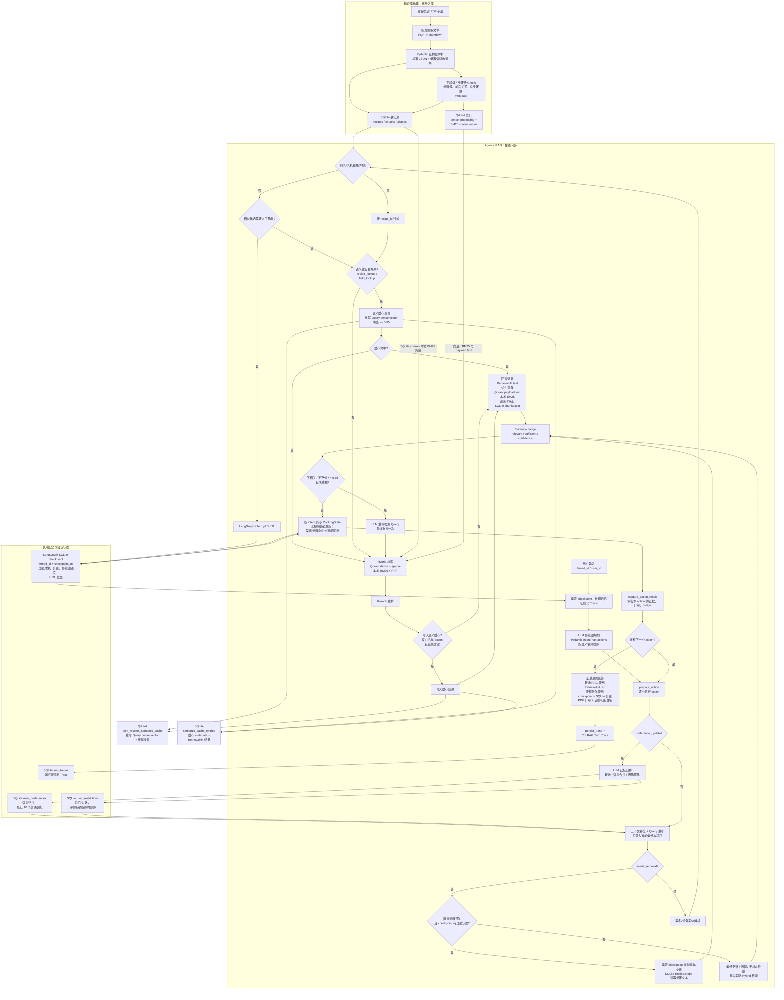

# 菜谱 Agentic RAG

这是一个面向 `data/菜谱_230道.pdf` 的菜谱 agentic-rag 工程。设计重点是：先把 PDF 结构化成可验收事实，再用 SQLite 保存事实源，用 Qdrant 做搜索索引，用 LangGraph 负责编排意图识别、检索、证据判断、HITL 和烹饪过程记忆。

## 当前能力

- PDF -> page Markdown -> recipe JSON -> structural chunks。
- 使用 Pydantic 解析标准 JSON；按字段和步骤切分 Chunk，不按字符数硬切；步骤 Chunk 附带步骤号、总步骤数和前后步骤关系 metadata。
- 解析置信度低于 `LOW_CONFIDENCE_THRESHOLD` 的菜谱会输出人工验收清单；这与在线问答阶段的 Evidence Judge 独立。
- SQLite 作为事实源，保存菜谱原始事实、chunks、别名、结构化长期记忆和 `turn_traces`；Qdrant 保存 dense vector + BM25 sparse vector 搜索索引。
- 菜名精确匹配、别名匹配后按 `recipe_id` 过滤检索；菜名不存在但存在相似候选时进入 Human-in-the-loop 确认，不自动替换相似菜。
- 使用 dense 语义检索、Qdrant BM25 sparse 检索、本地 BM25、RRF 融合和 rerank 重排构成 hybrid 检索。
- `recipe_lookup` 与 `field_lookup` 在 Hybrid 前支持语义缓存：SQLite 保存缓存元数据和 `RetrievalHit` 结果，独立 Qdrant collection 保存重写 Query 向量；缓存命中跳过 Hybrid/rerank，但仍经过 Evidence Judge、状态更新和最终回答。
- LangGraph 编排上下文补全、多意图规划、Query 重写、检索、Evidence Judge、状态更新、回答和 Trace 持久化；一轮可按语义依赖顺序执行多个 intent action，再汇总回答。
- 支持菜谱查询、字段查询、开始做菜、步骤导航、推荐、偏好更新、闲聊、拒答和澄清等 intent；推荐默认返回 5 道，用户指定数量时按指定数量处理。
- Checkpoint 按 `thread_id` 持久化当前菜谱、步骤、HITL 暂停位置、多意图 action 下标和重搜状态，支持“下一步”“重复”“回到上一步”等上下文表达。
- 长期记忆区分普通偏好与忌口/过敏：普通偏好语义归并且最多保留最近 10 个不同概念；忌口默认只增不减，仅在用户明确解除时删除。
- Evidence Judge 评估检索证据的相关性、充分性和置信度；不相关、不充分或置信度低于 `0.55` 时最多重搜一次，最终回答附带判断原因与缺失信息。
- 每轮保留 raw/completed/rewritten query、完整 intent 列表、命中项、分数、过滤条件、Evidence Judge、重搜次数、引用和状态变化；回答以 PDF 页码、菜谱编号和字段/步骤引用溯源。



## 目录

```text
dish-rag/
  main.py                            # 直接运行入口：python main.py ...
  requirements.txt                   # 传统依赖清单
  pytest.ini                         # 测试配置
  data/菜谱_230道.pdf                 # 原始 PDF
  configs/eval_queries.jsonl          # 原始 Hybrid 离线检索评测样例
  configs/eval_cache_pairs.jsonl      # 语义缓存同义 Query 对评测样例
  src/dish_rag/
    config.py                         # .env 和路径配置
    models.py                         # Recipe、Chunk、Trace、CookingState 等模型
    safety.py                         # 拒答和约束保留规则
    observability.py                  # trace JSON/终端展示
    cli.py                            # 命令实现，main.py 会调用它
    factory.py                        # 组装 store/retriever/graph
    ingest/
      pdf_extract.py                  # PDF 文本抽取，保留页码
      parser.py                       # 结构化菜谱解析
      chunker.py                      # 字段/步骤级 chunk
      exporter.py                     # JSON、Markdown、验收清单导出
      pipeline.py                     # 端到端 ingestion
    storage/
      sqlite_store.py                 # SQLite 事实源
      qdrant_store.py                 # Qdrant dense+sparse 索引
    retrieval/
      name_index.py                   # 菜名精确/相似匹配
      bm25.py                         # 本地 BM25 兜底检索
      hybrid.py                       # 混合检索 + 重排链路
    llm/opai.py                       # 对话、向量、重排模型客户端封装
    agent/
      prompts.py                      # 意图、重写、证据判断、回答提示词
      state.py                        # LangGraph 状态
      nodes.py                        # 图节点
      graph.py                        # 图编译和 checkpoint
    eval/offline.py                   # recall@k、precision@k
    eval/cache.py                     # 语义缓存命中、复用正确性与耗时评测
  tests/                              # parser/safety/chunker 单测
```

## 环境变量

复制 `.env.example` 为 `.env`，填写：

```bash
LLM_MODEL_ID=
LLM_API_KEY=
LLM_BASE_URL=
EMBEDDING_MODEL_ID=
EMBEDDING_API_KEY=
EMBEDDING_BASE_URL=
RERANK_MODEL_ID=
RERANK_API_KEY=
RERANK_BASE_URL=
QDRANT_URL=
QDRANT_API_KEY=
QDRANT_COLLECTION=dish_recipes
QDRANT_PATH=var/qdrant
SEMANTIC_CACHE_THRESHOLD=0.85
SQLITE_PATH=var/dish_rag.sqlite3
LANGGRAPH_CHECKPOINT_DB=var/langgraph_checkpoints.sqlite3
```

`LLM_*` 用于意图识别、Query 重写、Evidence Judge 和最终回答。`EMBEDDING_*` 用于 dense vector。`RERANK_*` 用于 rerank。Qdrant 只是搜索索引，回答前仍会围绕 SQLite 保存的 chunk 和 recipe metadata 做引用。

默认 `QDRANT_URL` 为空，系统会使用 `QDRANT_PATH=var/qdrant` 的嵌入式本地 Qdrant 存储，不需要单独启动索引服务。如果以后你要连接远程 Qdrant，再填写 `QDRANT_URL`。

本地 Qdrant 和在线 Qdrant 的核心作用一样：都是向量数据库，也都在这里承担“向量索引/搜索索引”的角色。本地 Qdrant 把索引文件放在本机 `var/qdrant`，适合学习、单机开发和小数据量验证；在线 Qdrant 把索引放在远程服务，适合多人共享、长期运行、权限管理、备份和更大的数据规模。无论本地还是在线，Qdrant 都不是唯一事实源，本项目的菜谱原始事实仍以 SQLite 为准。

## Qdrant 的三种运行方式

三种方式提供相同的 Qdrant 功能：保存 named dense vector、BM25 sparse vector 和 payload，并执行 metadata 过滤、dense/sparse 混合检索与 RRF 融合。项目统一通过 Python 的 `qdrant-client` 库访问它们，业务检索代码无需因部署方式变化而修改。

### 1. 本地嵌入式模式（当前默认）

Qdrant 不作为独立服务启动，而是由当前 Python 进程直接创建：

```python
QdrantClient(path="var/qdrant")
```

配置如下：

```env
QDRANT_URL=
QDRANT_PATH=var/qdrant
```

本项目当前正使用此模式。`var/qdrant/collection/dish_recipes/storage.sqlite` 是 `qdrant-client` 本地模式维护的内部索引文件，其中保存 Qdrant collection 数据；它不同于本项目作为事实源的 `var/dish_rag.sqlite3`，不应直接按业务 SQLite 表操作。此模式不需要 Docker 或独立 Qdrant 服务，适合学习、单机开发和小规模数据验证。

### 2. 本地 Docker 模式

让 Qdrant 作为本机 Docker 服务运行。在项目根目录执行：

```powershell
docker run -d --name dish-rag-qdrant `
  -p 6333:6333 -p 6334:6334 `
  -v "${PWD}\var\qdrant-docker:/qdrant/storage" `
  qdrant/qdrant
```

然后修改 `.env`：

```env
QDRANT_URL=http://localhost:6333
QDRANT_API_KEY=
QDRANT_COLLECTION=dish_recipes
```

这时项目会改用：

```python
QdrantClient(url="http://localhost:6333")
```

`QDRANT_PATH` 不再参与连接。Docker 容器内的索引数据会持久化到挂载的 `var/qdrant-docker`，并可通过 `http://localhost:6333/dashboard` 查看 Dashboard。适合本机模拟服务端、调试 Dashboard 或让多个本机进程访问同一个 Qdrant 服务。

### 3. 连接独立 Qdrant 服务

独立服务可以是 Qdrant Cloud，也可以是部署在其他服务器上的 Qdrant。只需配置服务地址和 API Key：

```env
QDRANT_URL=https://your-qdrant-host
QDRANT_API_KEY=your-api-key
QDRANT_COLLECTION=dish_recipes
```

项目同样自动使用：

```python
QdrantClient(url=QDRANT_URL, api_key=QDRANT_API_KEY)
```

适合多人共享、长期运行、权限管理、备份和更大规模的数据。切换到 Docker 或独立服务后，原本 `var/qdrant` 的本地索引不会自动迁移；应在新目标上重新执行 `python main.py ingest` 建立 collection。注意该命令会重建当前配置的 `dish_recipes` collection。

## 安装与运行

```bash
cd ".\dish-rag"
python -m venv .venv
.venv\Scripts\activate
python -m pip install -r requirements.txt
```

构建知识库：

```bash
python main.py ingest
```

如果暂时没有 embedding 或 Qdrant，可以先跳过索引，只生成 JSON/Markdown/SQLite：

```bash
python main.py ingest --no-index-qdrant
```

检索调试：

```bash
python main.py search "宫保鸡丁 不辣 不要花生怎么做"
```

运行一轮 Agent：

```bash
python main.py chat "我要做宫保鸡丁，怎么做？" --thread-id kitchen-001
```

离线评测：

```bash
python main.py eval-retrieval
```

语义缓存评测（100 组同义 Query 对，共 200 句话）：

```bash
python main.py eval-cache
```

查看本地 Qdrant collection 和前几条 point：

```bash
python main.py qdrant-preview
```

如果确实想看完整向量内容，可以加：

```bash
python main.py qdrant-preview --with-vectors
```

## 数据构建流程

1. `pdf_extract.extract_pages` 从 PDF 抽文本，并保留 page number。
2. `parser.parse_recipes_from_pages` 识别 `001 菜名` 标题行，并解析固定字段。
3. `chunker.chunk_recipe` 将每道菜切成基础信息、原材料、每个步骤、口味、过敏原、替换、保存等 chunk。
4. `exporter` 输出：
   - `build/recipes.json`
   - `build/chunks.jsonl`
   - `build/markdown/pdf_pages.md`
   - `build/markdown/recipes.md`
   - `build/review/low_confidence_recipes.md`
5. `SQLiteStore` 写入 recipes/chunks/aliases，作为事实源。
6. `QdrantRecipeIndex` 写入 named dense vector `dense` 和 sparse vector `bm25`。

## 完整链路总览

本项目有两条主链路：一条从 PDF 开始，把菜谱变成可检索知识库；另一条从用户输入开始，让 Agent 判断、检索、追溯证据并回答。

### PDF 到知识库链路

入口命令：

```bash
python main.py ingest --no-index-qdrant
```

如果 `.env` 已配置 embedding 模型，也可以运行：

```bash
python main.py ingest
```

执行顺序如下：

1. `main.py`：把 `src/` 加入 Python 搜索路径，然后调用 `dish_rag.cli.app`。
2. `cli.py`：`ingest()` 命令读取当前目录配置，调用 `run_ingest()`。
3. `config.py`：读取 `.env`，把 `PDF_PATH`、`BUILD_DIR`、`SQLITE_PATH`、`QDRANT_PATH` 等路径转成绝对路径。
4. `ingest/pipeline.py`：总控入库流程，按顺序调用 PDF 抽取、结构解析、chunk 切分、文件导出、SQLite 写入、可选 Qdrant 建索引。
5. `ingest/pdf_extract.py`：`extract_pages()` 优先用 `pdfplumber` 抽取每页文本；失败时用 `pdftotext -layout` 兜底。每一页会保留为一个字符串。`write_page_markdown()` 再把每页文本写入 `build/markdown/pdf_pages.md`，并加入 `<!-- page:n -->` 标记。
6. `ingest/parser.py`：`parse_recipes_from_pages()` 先把每页文本合并，并插入 `[[PAGE:n]]` 页码标记；`_find_recipe_blocks()` 用 `001 菜名` 这种标题行切出每道菜；`_extract_fields()` 按固定字段名抽取“基础信息、原材料、详细做法、口味特点、适合人群、饮食标签、过敏原提示、厨具与替换、保存与复热”；`_split_steps()` 用 `①②③` 拆步骤；`_score_recipe()` 根据字段完整度给解析置信度和人工验收警告。
7. `models.py`：`Recipe` 定义标准菜谱结构，字段包括 `recipe_id`、`name`、`ingredients`、`steps`、`allergens`、`storage`、`page_start` 等。parser 最终产出的就是 `Recipe` 对象。
8. `ingest/chunker.py`：`chunk_recipe()` 不按字符数切，而是按结构切：基础信息一个 chunk、原材料一个 chunk、每个步骤一个 chunk、口味/人群/标签/过敏原/厨具/替换/保存分别成 chunk。每个 chunk 都带 `recipe_id`、菜名、字段、页码和步骤号；步骤 chunk 还会带 `previous_step_no`、`next_step_no`、`total_steps`，用于回答“某个操作之后下一步是什么”。
9. `ingest/exporter.py`：输出 `build/recipes.json`、`build/chunks.jsonl`、`build/markdown/recipes.md` 和 `build/review/low_confidence_recipes.md`。
10. `storage/sqlite_store.py`：`SQLiteStore.migrate()` 建表；`upsert_recipes()` 写入菜谱事实和别名；`upsert_chunks()` 写入 chunk。SQLite 是事实源，后续回答引用时应以这里的数据为准（实际是用的每一个 chunk 的 payload 中的文本）。
11. `ingest/pipeline.py` 的 `_index_qdrant()`：如果启用 Qdrant 索引，会调用 `EmbeddingClient` 生成稠密向量，调用 `SparseBM25Encoder` 生成 BM25 稀疏向量，再写入 Qdrant。
12. `storage/qdrant_store.py`：`QdrantRecipeIndex.recreate_collection()` 创建包含 `dense` 和 `bm25` 两种向量的 collection；`upsert_chunks()` 把 chunk 文本、元数据和向量写入 Qdrant。

这一条链路最终得到三类产物：

- 人看的产物：`build/markdown/pdf_pages.md`、`build/markdown/recipes.md`、`build/review/low_confidence_recipes.md`
- 程序事实源：`var/dish_rag.sqlite3`
  - SQLite 可以用 DBeaver 打开，因为它是关系型数据库文件。
- 搜索索引：`var/qdrant`
  - 本地嵌入式 Qdrant 不太适合直接用 DBeaver 打开。
  - 可以写 Python 小脚本查看
  - 若使用 url，也可以用 Qdrant Dashboard

概括流程：先识别pdf，按页得到文本。然后再合并页码标记+页中内容，按菜谱结构（菜名）划分出每一道菜，再按每一道菜的格式（固定字段正则匹配）解析成 Recipe，如果recipe的置信度（完整度）低于阈值，就会进入人工核查（以便补齐菜谱稳定的结构）；最后按每道菜的结构字段和步骤切chunk。（因为依赖菜谱的稳定结构，所以置信度判断还是重要的。）

最终：
- Qdrant 有两个 collection：
  - `dish_recipes` 是菜谱 chunk 向量索引和 payload（向量附带的业务信息），每个 point 对应一个 `RecipeChunk`；对每个 chunk 做 dense embedding 和 BM25 sparse vector 后写入。
  - `dish_recipes_semantic_cache` 是独立的语义缓存索引；每个 point 对应一条已缓存的重写 Query，只保存该 Query 的 dense vector，以及缓存 ID、action、`recipe_id` 过滤、知识库版本、记忆指纹和 Top-K 等 payload，不保存菜谱正文，也不参与 BM25/RRF 检索。
  - 因为用户问题通常是局部的（有哪些过敏源、要煮多久），如果存整道菜，向量会把原材料、步骤、过敏原、保存方式全混在一起，检索粒度太粗。
  - 每个 Qdrant chunk 里会带菜谱级 metadata（菜肴名、种类、tags等）所以虽然 Qdrant 点是 chunk 级别，仍然知道它属于哪道菜。
- SQLite 里保存得更完整。--事实源。作为事实源备份，兜底、溯源时用。普通查询时用 Qdrant payload.text 形成 RetrievalHit.text，LLM基于此回答；目前只有“xxx 接下来/下一步”这类烹饪导航，根据命中 step_no 去 SQLite Recipe.steps 取当前/下一步。
  - recipes 表（整道菜的完整结构化事实）
  - chunks 表（每个 chunk 的完整原文内容）
  - aliases 表（保存菜名和别名，用于精确匹配）
  - long_term_memory 表
    - user_preferences 表（结构化普通偏好，语义归并后保留最近 10 个不同概念）
  - user_restrictions 表（结构化忌口/过敏，默认只增不减）
  - turn_traces 表（每轮可观测 trace，即系统这一轮为什么这么回答的“流水账”）
  - system_metadata 表
    - 保存 `knowledge_base_version`。它是本项目的知识库构建版本计数：每成功执行一次 `ingest`（导入并构建知识库），数值加一；语义缓存条目会记录写入时的数值，只有与当前数值相同才允许命中。因此重新入库后，即使旧缓存还留在数据库中，也不会被复用。
  - semantic_cache_entries 表
    - 保存语义缓存的元数据和完整 `RetrievalHit` 结果 JSON，包括缓存 ID、Query 文本、action、`recipe_id` 过滤、记忆指纹、知识库版本、Top-K、创建/访问时间和命中次数。

### chunk 的 text 和 metadata

`chunk` 的数据结构定义在 `src/dish_rag/models.py` 里的 `RecipeChunk`。它主要包含：

- `text`：这个 chunk 的原文内容，例如某一道菜的某一个步骤、原材料、口味特点等。
- `metadata`：这个 chunk 附带的业务信息，例如菜系、分类、烹饪方式、难度、耗时、过敏原、饮食标签、菜名等。步骤 chunk 还会额外带 `previous_step_no`、`next_step_no`、`total_steps`、`is_step_chunk`。

`chunk` 是在 `src/dish_rag/ingest/chunker.py` 的 `chunk_recipe()` 里生成的。这里不是按字符数切，而是按菜谱结构切：基础信息、原材料、每个步骤、口味、人群、标签、过敏原、厨具、替换、保存等分别成为 chunk。

真正被 embedding 的是 `chunk.text`。步骤 chunk 的 `text` 会显式加上步骤号，例如 `第2步：调成碗汁`，方便 hybrid 检索、rerank 和最终 LLM 组合回答时理解步骤顺序；SQLite `recipes` 表里的 `Recipe.steps` 仍保留不带“第x步”的结构化原文。embedding 位置在 `src/dish_rag/ingest/pipeline.py` 的 `_index_qdrant()`：

```python
texts = [chunk.text for chunk in chunks]
dense_vectors = embeddings.embed_texts(texts)
sparse_vectors = SparseBM25Encoder().encode_documents(texts)
```

也就是说：

- 稠密向量 `dense` 来自 `chunk.text`，用于语义相似度检索。
- 稀疏向量 `bm25` 也来自 `chunk.text`，用于关键词匹配检索。
- `chunk.metadata` 不会单独拿去 embedding，它不会变成向量。

`metadata` 的作用是过滤、展示、溯源、调试和步骤导航。例如用户问“宫保鸡丁怎么做”时，如果菜名精确匹配到 `recipe_id=001`，检索时可以用 payload 里的 `recipe_id` 做过滤；最终 trace 里也能展示命中的菜名、字段、页码、步骤号、过敏原、标签等信息。对于步骤 chunk，`next_step_no` 能帮助系统在命中“调好碗汁”这一步后找到它的下一步。

写入 Qdrant payload 的位置在 `src/dish_rag/storage/qdrant_store.py` 的 `upsert_chunks()`。这里会把 `chunk.text` 和 `chunk.metadata` 一起写入 payload：

```python
payload={
    "chunk_id": chunk.chunk_id,
    "recipe_id": chunk.recipe_id,
    "recipe_name": chunk.recipe_name,
    "field": str(chunk.field),
    "page": chunk.page,
    "step_no": chunk.step_no,
    "text": chunk.text,
    **chunk.metadata,
}
```

所以可以这样理解：`text` 是被检索算法理解和匹配的正文；`metadata` 是帮助系统知道“这个正文属于哪道菜、哪个字段、哪一页、有什么标签”的附加信息。

Qdrant 中的一个 point 大概长这样：

```text
collection: dish_recipes

point:
  id: 123456789
  vector:
    dense: [0.012, -0.034, 0.118, ...]
    bm25:
      indices: [12, 98, 305, ...]
      values: [0.8, 1.2, 0.5, ...]
  payload:
    chunk_id: "001:step_02"
    recipe_id: "001"
    recipe_name: "宫保鸡丁"
    field: "RecipeField.STEPS"
    page: 3
    step_no: 2
    text: "第2步：酱油、香醋、糖、盐和少量清水调成碗汁"
    previous_step_no: 1
    next_step_no: 3
    total_steps: 6
    is_step_chunk: true
    cuisine: "川菜"
    category: "热菜"
    cooking_method: "炒"
    difficulty: "中等"
    time: "约 35 分钟"
    allergens: ["大豆", "花生/坚果", "酒精"]
    diet_tags: ["含添加糖", "辛辣"]
```

### 用户输入到回答链路

入口命令：

```bash
python main.py chat "我要做宫保鸡丁，下一步怎么做？" --thread-id kitchen-001
```

执行顺序如下：

1. `main.py`：启动 CLI。
2. `cli.py`：`chat()` 命令调用 `make_graph()` 创建 LangGraph 应用，并把 `thread_id`、`user_id`、`user_query` 放入初始状态。
3. `factory.py`：组装依赖。`make_store()` 创建 SQLite 事实库；`make_retriever()` 创建混合检索器；`make_graph()` 创建模型客户端、检索器、节点容器和 LangGraph 图。
4. `agent/graph.py`：定义多意图循环图：`start_trace -> classify_intent -> prepare_action -> rewrite_query -> retrieve -> judge_evidence -> update_cooking_state -> capture_action_result`；若还有 action 则回到 `prepare_action`，否则 `answer -> persist_trace`。证据不合格时会经 `retry_evidence` 最多重搜一次；菜名不存在但有相似候选时会走 `hitl_recipe_choice`。
5. `agent/state.py`：定义图中流动的状态字段，例如原始问题、重写结果、检索命中、证据判断、回答、引用、烹饪状态和 trace。
6. `agent/nodes.py` 的 `start_trace()`：加载当前用户结构化长期记忆和 checkpoint 状态，记录本轮开始前的烹饪状态。
7. `safety.py` 和 `nodes.classify_intent()`：先做拒答检查，再调用 LLM 规划经 Pydantic 校验的有序 `IntentPlan.actions`，抽取实体、限制并按语义依赖安排执行顺序。
8. `nodes.prepare_action()`：取出当前 `IntentPlan.actions[current_action_index]`，重置上一 action 的临时检索状态；若为 `preference_update`，先归并并写入结构化偏好/忌口，使后续 action 可立即使用本轮记忆。
9. `nodes.rewrite_query()`：调用 LLM 重写 Query，但必须保留“不辣、不要花生、过敏”等限制。`detect_constraint_loss()` 如果发现限制丢失，会把 intent 改成 `need_clarification`，不继续错误检索。
10. `retrieval/name_index.py`：如果识别到菜名，先做别名精确匹配。精确命中后用 `recipe_id` 过滤检索，避免把相似菜混进来。
11. `retrieval/hybrid.py`：`retrieve()` 使用 Qdrant 稠密/稀疏检索和 SQLite chunks 的本地 BM25，RRF 融合、去重后交给 rerank。
    - embedding 更像“先各自理解，再比距离”；
    - rerank 更像“把问题和候选答案放一起精读打分”。
11. `storage/qdrant_store.py`：`hybrid_search()` 使用稠密向量和 BM25 稀疏向量分别预检索，再用 RRF 融合结果。
    - RRF 是 Reciprocal Rank Fusion，“倒数排名融合”。它不是直接看原始分数，而是看排名。一个 chunk 在多个检索结果里排名都靠前，它的融合分就更高。
    - 命中后，回答依据主要用的是 RetrievalHit.text（来自Qdrant payload 里的 text；本地兜底时来自SQLite chunk 的 text）
12. `retrieval/bm25.py`：当 Qdrant 或向量模型不可用时，用本地 BM25 对 SQLite chunk 做兜底搜索。
13. `llm/opai.py`：封装 chat、embedding、rerank 三类模型调用。Agent 节点只调用封装后的 `ChatClient`、`EmbeddingClient`、`RerankClient`。
14. `nodes.judge_evidence()`：让 Evidence Judge 判断检索证据是否相关、是否足够，并输出可量化 `confidence`。
15. `nodes.update_cooking_state()`：如果用户在做菜，更新当前 thread 的 `active_recipe_id`、`current_step_no`、`last_action`。一个 thread 只维护一道正在做的菜。
16. `nodes.answer()`：基于证据生成回答，并要求带 PDF 页码、菜谱编号、字段或步骤引用。如果没有证据，不自动替换成相似菜。
17. `nodes.persist_trace()` 和 `observability.py`：把本轮 raw query、intent、rewritten query、命中项、分数、证据判断、引用和状态变化写入 SQLite，并在 CLI 中展示。

概括：query -> 意图识别/重写 -> （菜名精确匹配 -> ）recipe_id 过滤 -> hybrid 检索 -> rerank -> 证据判断 -> LLM 基于 chunk 回答
- hybrid.py -> retrieve() -> 生成 query 的 dense/sparse 表示 -> hybrid_search() -> 本地 BM25 -> 合并去重 -> rerank -> 返回最终 hits

整体graph中的node顺序（node的具体实现见node.py）：

```text
start_trace
-> classify_intent
-> rewrite_query
-> retrieve
  （-> hitl_recipe_choice）
  （-> retrieve_selected_recipe）
-> judge_evidence
-> update_cooking_state
-> answer
-> persist_trace
```

### 用户链路 demo

当前实现里有“用户 Query 改写后再 embedding/检索”，暂时没有实现“先让大模型生成假设答案，再对假设答案 embedding”的 HyDE 流程。

在 `.env` 里的 LLM、Embedding、Rerank 都配置完整，并且已经运行过 `python main.py ingest` 建好 Qdrant 索引的情况下，当前是：

```text
用户原始 Query
-> LLM 做意图识别、上下文补全、菜名实体解析
-> LLM 做 Query 重写，并保留用户限制
-> 若 action 为 recipe_lookup 或 field_lookup，先以 rewritten_query 检查语义缓存
   -> 缓存命中：复用 RetrievalHit，跳过 Hybrid/rerank
   -> 缓存未命中：继续 Hybrid，并写入缓存供后续同义 Query 使用
-> 对 rewritten_query 做 embedding，得到 query dense vector
-> 用 FastEmbed BM25 把 rewritten_query 编成 query sparse vector
-> Qdrant 同时做 dense 向量相似度检索和 BM25 稀疏检索
-> Qdrant 用 RRF 融合 dense/sparse 两路结果
-> 本地 BM25 从 SQLite chunks 做兜底检索
-> 合并去重
-> 调用 Rerank 模型重排候选 chunk
-> Evidence Judge 判断证据是否足够
-> LLM 基于证据生成回答
```

注意：当前没有 HyDE，所以不会先生成一段“假设答案”再对假设答案做 embedding。

Agentic RAG 的“自主决策”主要体现在 LangGraph 节点里：

- `classify_intent`：通过 LLM 输出经 Pydantic 校验的 `IntentPlan.actions`，识别一个或多个 intent、是否检索、实体和限制，并按语义依赖规划执行顺序。
  - `prepare_action`：逐项装载当前 action、清理上一 action 的临时检索状态；偏好更新会先归并写入结构化长期记忆，使后续 action 可立即使用。
- `rewrite_query`：根据 checkpoint、当前偏好与忌口补全并重写 Query，同时检查限制是否被保留。
- `retrieve`：优先菜名精确匹配并按 `recipe_id` 过滤；否则按需要进入全库 hybrid 或 HITL，不自动替换相似菜。
- `judge_evidence` 与 `retry_evidence`：判断相关性、充分性和置信度；不相关、不充分或低置信度时最多重搜一次。
- `update_cooking_state`：仅为流程相关 action 维护当前菜谱和步骤。
- `capture_action_result`：隔离保存每项 action 的命中、Judge、重搜次数和引用，避免后续 action 覆盖前项结果。
- `answer`：在所有 action 完成后汇总回答，保留 PDF 引用，并附上证据不足的判断原因。

示例 1：用户问“宫保鸡丁怎么做”

```text
用户 Query：宫保鸡丁怎么做
-> classify_intent 识别为菜谱查询/做法查询，并抽取菜名“宫保鸡丁”
-> rewrite_query 可能改写成“宫保鸡丁的原材料和完整步骤做法”
-> retrieve 先查 SQLite aliases，精确命中 recipe_id=001
-> 用 recipe_id=001 作为过滤条件
-> 对 rewritten_query 生成 dense vector 和 sparse vector
-> Qdrant 在 recipe_id=001 范围内做 dense 相似度检索 + BM25 稀疏检索
-> Qdrant RRF 融合结果
-> 本地 BM25 从 SQLite chunks 做兜底补充
-> Rerank 模型重排候选 chunk
-> 通常会优先保留 ingredients 和多个 steps chunk
-> Evidence Judge 判断证据是否足够
-> answer 输出原材料和步骤，并附引用
```

更理想的增强方向是：当系统判断用户问的是“整道菜怎么做”，且菜名精确命中时，可以直接从 SQLite `recipes` 表取整道菜的 `ingredients + steps`，再用 Qdrant chunk 作为辅助证据。这样比只依赖 top-k chunk 更稳。

示例 2：用户问“宫保鸡丁的第二步是什么”

```text
用户 Query：宫保鸡丁的第二步是什么
-> classify_intent 识别为字段/步骤查询，并抽取菜名“宫保鸡丁”
-> rewrite_query 改写时保留“第二步”这个关键约束
-> retrieve 先查 SQLite aliases，精确命中 recipe_id=001
-> 用 recipe_id=001 作为过滤条件
-> 对 rewritten_query 生成 dense vector 和 sparse vector
-> Qdrant 在 recipe_id=001 范围内做 dense 相似度检索 + BM25 稀疏检索
-> Qdrant RRF 融合结果
-> 本地 BM25 从 SQLite chunks 做兜底补充
-> Rerank 模型重排候选 chunk
-> 检索目标更集中，应该优先保留 step_02 或与第二步最相关的步骤 chunk
-> Evidence Judge 判断命中步骤是否足够
-> answer 只回答第二步，并附引用
```

这两个问题都是拿 rewritten_query 的 embedding 和 Qdrant 里每个 chunk 的 embedding 做相似度匹配。

这两个问题的区别是：前者是整道菜做法，应该尽量返回完整原材料和全部步骤；后者是步骤级问题，应该精确返回某一个步骤 chunk。

示例 3：用户说“宫保鸡丁里调好碗汁了接下来做什么”

```text
用户 Query：宫保鸡丁里调好碗汁了接下来做什么
-> classify_intent 由 LLM 识别为 cooking_navigation
-> LLM 判断这是“完成了某个操作后问接下来”，needs_retrieval=true
-> rewrite_query 会保留“调好碗汁了接下来做什么”这个语义
-> retrieve 仍然走原来的检索链路：先查 SQLite aliases，精确命中 recipe_id=001
-> 用 recipe_id=001 作为过滤条件
-> 对 rewritten_query 生成 dense vector 和 sparse vector
-> Qdrant 在 recipe_id=001 范围内做 dense 相似度检索 + BM25 稀疏检索
-> Qdrant RRF 融合结果
-> 本地 BM25 从 SQLite chunks 做兜底补充
-> Rerank 模型重排候选 chunk
-> 如果排在前面的命中是步骤 chunk，例如 step_02“调成碗汁”
-> update_cooking_state 把 current_step_no 同步为 step_03
-> LangGraph checkpoint SQLite 保存新的 current_step_no
-> answer 从 SQLite Recipe.steps 读取 step_03 并回答
```

这类问题仍然走普通 hybrid 检索，也会对 rewritten query 做 embedding。系统不会额外抽取“调好碗汁”，也不会另写一套模糊匹配步骤的逻辑；用户描述的操作对应哪一步，仍由 Qdrant dense/BM25、本地 BM25 和 rerank 共同决定。区别是：如果 hybrid 命中了某个步骤 chunk，`update_cooking_state()` 会用命中的 `step_no` 更新 checkpoint 中的 `current_step_no`，然后 `answer()` 从 SQLite 的完整 `Recipe.steps` 读取当前应执行步骤。

补充：不是步骤的 chunk 没有步骤相邻关系。它们的 `RecipeChunk.step_no` 是 `None`，metadata 里也不会有 `previous_step_no`、`next_step_no`、`total_steps`、`is_step_chunk`。只有 `field=steps` 的步骤 chunk 才有这些字段。

示例 4：用户直接问“再下一步”

```text
前置 checkpoint：
active_recipe_id=001
current_step_no=3

用户 Query：再下一步
-> classify_intent 由 LLM 识别为 cooking_navigation
-> 如果 LLM 判断不需要检索，needs_retrieval=false
-> retrieve 不强行查 Qdrant，hits=[]
-> Evidence Judge 看到 checkpoint 里已有当前菜谱状态，判定可直接回答
-> update_cooking_state 基于 checkpoint 把 current_step_no 从 3 推进到 4
-> answer 从 SQLite Recipe.steps 读取 step_04 并回答
-> checkpoint 保存 current_step_no=4
```

所以“再下一步”“这一步再下一步”“然后呢”这类表达，不需要重新从全库猜；只要 checkpoint 里有当前菜谱和当前步骤，就按状态继续推进。

示例 5：当前 thread 没有菜谱状态，用户也没有说菜名

```text
用户 Query：调好碗汁了接下来做什么
-> classify_intent 识别为 cooking_navigation
-> 但没有 active_recipe_id，也没有显式菜名
-> retrieve 跳过全库检索，避免随便命中一到相似菜
-> answer 会先澄清“你正在做哪道菜？”
```

### 用户输入到检索调试链路

入口命令：

```bash
python main.py search "麻婆豆腐有哪些过敏原"
```

这条链路不走完整 Agent 图，只用于看检索效果：

1. `main.py` 启动 CLI。
2. `cli.py` 的 `search()` 调用 `make_retriever()`。
3. `factory.py` 组装 SQLite、Qdrant、embedding、BM25、rerank。
4. `retrieval/hybrid.py` 执行混合检索。
5. CLI 直接打印命中分数、来源、页码、菜谱编号、字段和文本。

## 建议阅读顺序

如果想按执行链路学习代码，建议这样看：

1. `main.py`：理解为什么可以直接 `python main.py ...` 运行。
2. `cli.py`：看四个命令分别进入哪条链路：`ingest`、`search`、`chat`、`eval-retrieval`。
3. `config.py`：看 `.env` 如何变成程序配置，路径如何归一化。
4. `models.py`：先看核心数据结构，尤其是 `Recipe`、`RecipeChunk`、`QueryRewrite`、`RetrievalHit`、`CookingState`、`TurnTrace`。
5. `ingest/pipeline.py`：看 PDF 入库总控流程。
6. `ingest/pdf_extract.py`：看 PDF 如何变成逐页文本和 page Markdown。
7. `ingest/parser.py`：重点看菜谱如何按标题、字段和步骤解析成 `Recipe`。
8. `ingest/chunker.py`：看 `Recipe` 如何按字段和步骤变成 chunk。
9. `ingest/exporter.py`：看 JSON、Markdown、人工验收清单如何写出。
10. `storage/sqlite_store.py`：看事实源表结构，以及菜谱、chunk、别名、记忆、trace 如何入库。
11. `storage/qdrant_store.py`：看 Qdrant collection 如何创建，稠密向量和 BM25 稀疏向量如何写入与检索。
12. `retrieval/name_index.py`：看菜名精确匹配和相似菜候选。
13. `retrieval/bm25.py`：看本地 BM25 兜底检索。
14. `retrieval/hybrid.py`：看精确匹配、Qdrant、BM25、rerank 如何组合。
15. `llm/opai.py`：看模型调用统一封装。
16. `agent/prompts.py`：看意图识别、Query 重写、证据判断和回答生成的提示词。
17. `agent/state.py`：看 LangGraph 节点之间传递哪些状态。
18. `agent/nodes.py`：看用户输入进入 Agent 后每一步如何处理，尤其是 cooking_navigation 如何用 checkpoint 状态或 hybrid 命中的步骤 chunk 推进当前步骤。
19. `agent/graph.py`：看节点如何连接成完整 LangGraph。
20. `observability.py`：看每一轮可观测 trace 如何展示。
21. `eval/offline.py` 和 `configs/eval_queries.jsonl`：看离线检索指标如何计算。

## Agentic RAG 自主决策体现

本项目不是“用户问一句就固定检索一次”的普通 RAG，而是用 LangGraph 把多个判断节点串起来。自主决策主要体现在这些地方：

- 是否拒答：`safety.py` 和 `nodes.classify_intent()` 会先判断请求是否涉及高风险或医疗化内容。
- 多意图规划与顺序：`nodes.classify_intent()` 会让 LLM 输出有序 `IntentPlan.actions`；LLM 按语义依赖（根据 prompt 的要求）决定执行顺序，例如会先执行影响后续检索的 preference_update，再执行可使用该记忆的 recommendation 等 action。
- 判断单项意图：每个 action 可以是查菜谱、问字段、开始做菜、问下一步、推荐、更新偏好或普通闲聊。
- 是否需要检索：意图识别结果里有 `needs_retrieval`，不需要检索的问题不会强行走向量库。
- 上下文补全：如果用户说“它下一步怎么做”，系统会结合当前 thread 的烹饪状态补全“它”指哪道菜。
- 菜谱实体解析：系统会抽取 Query 里的菜名实体，比如“宫保鸡丁”。
- Query 重写：`nodes.rewrite_query()` 会把原始问题改写成更适合检索的 Query。
- action 执行准备：`nodes.prepare_action()` 会装载当前 action、清理上一 action 的 hits/Judge/HITL 临时状态；偏好更新先调用记忆归并 LLM，写入 `user_preferences` 或 `user_restrictions`。
- 约束保护：重写时不能删除“不辣、不要花生、过敏”等限制；如果发现限制丢失，会转为澄清，不继续错误检索。
- 菜名精确匹配优先：`retrieval/name_index.py` 先查 SQLite aliases；精确命中后用 `recipe_id` 过滤检索，避免相似菜混入。
- 步骤状态导航：`retrieval/hybrid.py` 负责召回用户描述的操作对应的步骤 chunk；`agent/nodes.py` 会根据命中的 `step_no` 同步 `CookingState.current_step_no`，或在没有检索时直接按 checkpoint 推进。
- 菜名不存在时 HITL：如果菜名不存在，系统不会自动替换成相似菜，而是暂停图执行，让用户确认是否选择候选。
- 检索方式选择与融合：`retrieval/hybrid.py` 会组合 Qdrant 稠密检索、BM25 稀疏检索、本地 BM25 兜底和 rerank。
- 证据是否足够：`nodes.judge_evidence()` 会判断命中内容是否相关、是否足够回答，并输出 `confidence`、原因和缺失项；不相关、不充分或 `confidence < 0.55` 时会经 `retry_evidence` 最多重搜一次。
- 烹饪状态更新：`nodes.update_cooking_state()` 会维护当前 thread 正在做哪道菜、做到第几步，并理解“下一步、重复、上一步”。
- action 结果隔离与回答边界控制：`nodes.capture_action_result()` 会保存每项 action 的独立结果；`nodes.answer()` 再按原顺序合并回答，基于证据引用 PDF，不编造、不把相似菜当成用户指定菜。
- 可观测性记录：`nodes.persist_trace()` 会保存每轮 raw/completed/rewritten query、完整 action 结果、命中项、分数、证据判断、重搜次数、引用和状态变化，方便回放决策过程。
  - checkpoint = LangGraph 保存的图运行状态；
    - HITL：checkpoint 用来暂停后继续
    - 上下文/突然换问题：checkpoint 用来记住 thread 状态，辅助理解和状态切换
  - trace = 我们额外记录的可观测调试信息
    - trace 可以作为状态的一部分被带着走
    - 但 checkpoint 的目的不是专门保存 trace

### 当前意图类型与处理方式

意图类型定义在 `src/dish_rag/models.py` 的 `Intent`，提示词约束在 `src/dish_rag/agent/prompts.py` 的 `INTENT_SYSTEM`。当前可识别的 intent 有：

- `recipe_lookup`
  - 含义：查询某道菜整体做法。
  - 例子：`宫保鸡丁怎么做？`
  - 后续处理：通常走 hybrid 检索；先抽取菜名，精确命中后用 `recipe_id` 过滤，再 `hybrid -> rerank -> Evidence Judge -> 把命中 chunks 的 text 给 LLM 生成完整做法回答`。如果命中菜谱，会把这道菜写入 checkpoint 的 `CookingState`，设为当前 thread 正在做的菜；如果是新菜，`current_step_no` 默认设为 1。

- `field_lookup`
  - 含义：查询某道菜某个字段，例如原材料、过敏原、保存方式、第几步。
  - 例子：`宫保鸡丁的原料是什么？`
  - 后续处理：通常走 hybrid 检索；菜名精确命中后缩小到该菜谱，再 `hybrid -> rerank -> Evidence Judge -> 把相关字段/步骤 chunks 的 text 给 LLM 回答`。如果查询命中了步骤 chunk，例如“宫保鸡丁第二步是什么”，会把该步骤的 `step_no` 写入 checkpoint 的 `CookingState.current_step_no`。

- `cooking_start`
  - 含义：用户明确开始做一道菜。
  - 例子：`我要开始做宫保鸡丁。`
  - 后续处理：走 hybrid 检索定位菜谱证据；回答后 `update_cooking_state()` 初始化 `active_recipe_id`、`active_recipe_name`、`current_step_no=1`、`total_steps`，并由 checkpoint 保存。

- `cooking_navigation`
  - 含义：做菜过程导航，例如下一步、再下一步、然后呢、接下来做什么、上一步、重复一下，或用户说自己做完了某个操作。
  - 例子：`调好碗汁了接下来做什么？`
  - 后续处理：分两种。纯状态导航可不走 hybrid，直接用 checkpoint 推进 `current_step_no`；如果用户描述了刚完成的具体操作，则在当前菜谱内走 `hybrid -> rerank` 定位步骤 chunk，再同步 `current_step_no` 并从 SQLite `Recipe.steps` 读取当前步骤回答。

- `recommendation`
  - 含义：根据用户的使用场景、适用人群、饮食目标、口味或限制，从菜谱库中推荐多道候选菜；不要求用户先给出具体菜名。
  - 例子：`推荐 3 道适合健身、方便做的高蛋白菜。`、`老人少油菜有什么推荐？`
  - 后续处理：复用 `Query 重写 -> Qdrant dense/BM25 + 本地 BM25 -> rerank -> Evidence Judge -> 回答` 链路。检索会扩大候选范围，再按 `recipe_id` 去重，保证返回的是不同菜谱而非同一道菜的多个 chunk。LLM 在意图识别阶段抽取用户指定的数量；未指定时默认推荐 5 道。推荐本身不写入长期记忆；若同一输入还包含偏好或忌口更新，LLM 会将 `preference_update` 排在前面，推荐 action 可使用本轮刚更新的结构化记忆。

- `preference_update`
  - 含义：用户更新长期偏好、禁忌或过敏信息。
  - 例子：`我不吃花生，以后都少辣。`
  - 后续处理：通常不走 hybrid；`prepare_action()` 调用记忆归并 LLM，将结果写入 SQLite 的 `user_preferences` 和 `user_restrictions`。普通偏好按语义归并并只保留最近 10 个不同概念；忌口/过敏默认只增不减，只有用户明确表示不再忌口、不再过敏或现在可以吃时才删除。后续 LLM 提示词只注入活跃偏好和忌口的 `canonical` 内容，不注入原始 Query、补全 Query、原始说法或内部时间戳。

- `chitchat`
  - 含义：普通闲聊或不需要菜谱证据的问题。
  - 例子：`你好，你是谁？`
  - 后续处理：通常不走 hybrid；`needs_retrieval=false` 时不会强行检索，直接由回答节点处理。

- `unsafe_or_refusal`
  - 含义：高风险、医疗化或不适合回答的请求。
  - 例子：危险操作、明显不该提供的请求。
  - 后续处理：不走 hybrid；`safety.py` 或意图识别拦截后，`answer()` 直接拒答。

- `need_clarification`
  - 含义：信息不足，或 Query 重写丢失了用户限制。
  - 例子：`它怎么做？` 但当前上下文没有“它”；或重写时漏掉 `不辣`。
  - 后续处理：不继续错误 hybrid 检索；先让用户澄清，或要求用户重新说明必须保留的限制。

需要注意：当前意图识别依赖 LLM 输出 JSON，不是硬编码规则分类器。`safety.py` 会先做一层确定性拒答检查；之后 `classify_intent()` 再让 LLM 输出 `intent`、`completed_query`、`recipe_entities`、`needs_retrieval`、`preserved_constraints`。

意图识别准确率可以这样评估：

- 准备一份人工标注数据集，每条包含 `query`、期望 `intent`、期望 `recipe_entities`、是否 `needs_retrieval`。
- 批量调用 `classify_intent()` 或抽出同样的 prompt 调 LLM，保存模型输出。
- 计算 intent accuracy：`预测 intent == 标注 intent` 的比例。
- 计算菜名抽取准确率：可以用 exact match、precision、recall、F1。
- 计算 `needs_retrieval` 准确率：判断该检索却没检索、该不检索却检索的比例。
- 单独统计约束保留：例如“不辣、不要花生、过敏”等限制是否进入 `preserved_constraints`，后续重写是否丢失。
- 最后做混淆矩阵，重点看 `recipe_lookup` 和 `field_lookup`、`cooking_start` 和 `cooking_navigation` 是否容易互相误判。

这部分可以后续扩展到 `configs/eval_queries.jsonl`，增加 `expected_intent`、`expected_entities`、`expected_needs_retrieval` 字段，再写一个 `eval-intent` 命令专门评估。

### 多意图顺序执行

一条用户输入不再限制为一个 intent。`classify_intent()` 会让 LLM 输出一个经 Pydantic 校验的 `IntentPlan.actions` 列表，每个动作包含 intent、补全 Query、菜名实体、推荐数量、是否检索和必须保留的限制。LLM 按语义依赖安排动作顺序：会影响后续检索的 `preference_update` 会先执行，随后动作可以使用本轮刚保存的偏好。

```text
用户：我健身、不吃花生，推荐 3 道高蛋白菜；另外宫保鸡丁下一步是什么？
-> preference_update：经记忆归并后写入 SQLite user_preferences / user_restrictions，并同步本轮 user_memory
-> recommendation：携带更新后的 memory，走 rewrite -> hybrid -> rerank -> Evidence Judge
-> cooking_navigation：从 checkpoint 读取宫保鸡丁状态并推进步骤
-> answer：合并上述三个动作为一次回答，并保留各自引用
```

每项动作执行完成后都会写入 `action_results`，再执行下一项，因此后续动作不会覆盖前面动作的 hits、Evidence Judge 或引用。需要检索的动作各自最多重检索一次；`recommendation` 不更新 `CookingState`，而 `cooking_start`、`recipe_lookup`、步骤型 `field_lookup` 和 `cooking_navigation` 仍按原有规则更新做菜状态。若某项动作进入 HITL，LangGraph checkpoint 会保存当前动作下标，用户确认后从该动作继续，完成后再执行后续动作。

## 结构化长期记忆

长期记忆进一步拆分为 `user_preferences` 与 `user_restrictions`两张表：通用 Agent 提示词只接收当前偏好与忌口，不接收原始 Query、补全 Query 或时间戳。

| 表 | 用途与保留规则 | 字段说明 |
| --- | --- | --- |
| `user_preferences` | 保存普通饮食偏好；同义表达由记忆归并 LLM 合并；每个用户仅保留按 `last_seen_at` 排序的最近 10 个不同概念。 | `user_id`：用户；`canonical`：语义归一化名称，也是同一用户内的概念键；`phrases_json`：该概念出现过的原始说法数组；`first_seen_at`：首次记录时间；`last_seen_at`：最近确认时间。 |
| `user_restrictions` | 保存忌口、过敏和不能吃的食材；不受 10 条上限影响，默认只增不减。 | 字段与 `user_preferences` 相同；只有用户明确表达“不再忌口/不再过敏/现在可以吃”时，记忆归并 LLM 才会输出删除操作。 |

例如，“低脂”与“减脂”可归并为同一个 `canonical`，更新其 `last_seen_at`，并在 `phrases_json` 中同时保留两种原始说法。旧版 `long_term_memory.preference_latest` 首次读取时会保守迁移为忌口，避免遗漏已有风险限制。


## Query 重写保护

`safety.py` 会抽取“不要、不吃、不能、不辣、过敏、低糖、少油”等约束。`agent/prompts.py` 明确禁止重写模型删除或弱化这些限制。`nodes.rewrite_query` 会检查重写后的 query，如果发现限制丢失，就把 intent 改成 `need_clarification`，不会继续带着错误 query 检索。

## HITL 规则

当用户提到菜名但 `RecipeNameIndex.exact` 找不到精确别名时，系统只检索相似菜候选，不会自动替换。`nodes.hitl_recipe_choice` 会触发 LangGraph interrupt，暂停图执行，让用户明确选择候选菜或放弃。

## 兜底机制

- PDF 抽取兜底：`pdf_extract.py` 优先用 `pdfplumber` 抽取文本；失败时用 `pdftotext -layout` 兜底。
- Qdrant 检索兜底：`retrieval/hybrid.py` 如果 Qdrant、embedding 或 hybrid 检索异常，会返回空的 Qdrant 命中，不让程序崩溃。
- 本地 BM25 兜底：无论 Qdrant 是否可用，`retrieval/hybrid.py` 都会再跑 `LocalBM25`，它基于 SQLite chunks 做关键词检索。
- Rerank 配置兜底：`RerankClient.rerank()` 如果没有配置 `RERANK_BASE_URL`、`RERANK_MODEL_ID`，或没有候选文档，会保留原候选顺序，并给递减分数。
- 菜名不存在兜底：精确别名找不到时，不自动替换成相似菜，而是进入 HITL，让用户确认候选。
- 证据不足兜底：`judge_evidence()` 如果 `relevant=false`、`sufficient=false` 或 `confidence<0.55`，且本轮还没有重试过，图会根据缺失项重写 Query 并重检索一次。第二次判断后不再重试；`answer()` 仍生成回答，但会在最终证据仍不足时追加“证据不足”提示。
- 烹饪状态兜底：用户问“再下一步”但 checkpoint 没有当前菜谱状态、也没有显式菜名时，系统不全库乱搜，会先问用户正在做哪道菜。

## 烹饪状态

`CookingState` 每个 thread 只维护一道正在制作的菜：

- `active_recipe_id`
- `active_recipe_name`
- `current_step_no`
- `total_steps`
- `last_action`

`CookingState` 是 LangGraph state 的一部分，会由 LangGraph checkpoint 保存到 `LANGGRAPH_CHECKPOINT_DB`。因此同一个 `thread_id` 里，用户后续说“再下一步”“这一步再下一步”“重复一下”“回到上一步”，系统可以直接读取 checkpoint 里的 `current_step_no`，不用重新从全库猜。

### Checkpoint 字段与命名空间

LangGraph checkpoint 使用下面的字段共同定位一条状态版本：

- `thread_id`：对话线程 ID。不同 `thread_id` 可以维护不同的烹饪状态。
- `checkpoint_ns`：checkpoint 命名空间，用于区分同一个 thread 下的子图、状态分支或不同状态域。当前项目没有显式配置，默认是空字符串 `""`。
- `checkpoint_id`：某一次图执行后的具体状态版本 ID。
- `parent_checkpoint_id`：上一个状态版本的 ID，用于把同一个 thread 的 checkpoint 串成状态链。

因此 checkpoint 表的唯一定位关系可以理解为：

```text
(thread_id, checkpoint_ns, checkpoint_id)
```

`checkpoint` 字段保存序列化后的 LangGraph state 快照，可能包含 `user_query`、`query_rewrite`、`hits`、`evidence_judge`、`cooking_state`、`answer`、`citations`、`trace` 和 `memory` 等 channel。`writes` 表则保存图节点对这些 channel 的增量写入。checkpoint 不是“一行一轮对话”，而是同一个 thread 下多个连续的状态版本。

其中出现乱码，是因为 checkpoint 使用 MsgPack 二进制序列化，直接用 SQLite 文本查看器打开会显示成乱码，并不代表数据损坏。要正确查看内容，应使用支持 MsgPack/LangGraph checkpoint 反序列化的程序读取，而不是把 `checkpoint` BLOB 当作普通文本打开。

如果以后在外层增加 QA、冰箱 Text-to-SQL、闲聊等子图，可以继续共用同一张 checkpoint 表；是否使用不同的 `checkpoint_ns` 取决于是否希望为这些子图建立独立的状态命名空间。顶层意图本身通常直接作为 LangGraph state 字段保存，不必用 `checkpoint_ns` 表示。

当前会更新 `CookingState` 的情况：

- `recipe_lookup`：只要检索命中菜谱，就把该菜设为当前 thread 正在做的菜；如果是新菜，`current_step_no` 默认设为 1。
- `field_lookup`：如果查询命中的是步骤 chunk，就把命中的 `step_no` 设为当前步骤。
- `cooking_start`：初始化当前菜、当前第 1 步和总步数。
- `cooking_navigation`：根据 checkpoint 推进/回退/重复步骤，或根据 hybrid 命中的步骤 chunk 同步当前步骤。

线程由调用 LangGraph 时传入的 `thread_id` 区分。CLI 里可以这样指定：

```bash
python main.py chat "下一步" --thread-id kitchen-001
```

这个 `thread_id` 会放进：

```python
config={"configurable": {"thread_id": thread_id}}
```

LangGraph checkpoint 会用它作为状态 key。因此不同 `thread_id` 可以维护不同做菜进度，例如：

```text
kitchen-001：宫保鸡丁，当前第 3 步
kitchen-002：麻婆豆腐，当前第 1 步
```

如果要切换菜或状态，推荐两种方式：

- 换一个新的 `thread_id`：最干净，不会污染原来的做菜进度。
- 在同一个 `thread_id` 里重新开始一道菜：如果用户说“我要开始做麻婆豆腐”，并被识别成 `cooking_start`，`update_cooking_state()` 会把当前 thread 的 `active_recipe_id`、`active_recipe_name`、`current_step_no`、`total_steps` 覆盖成新菜。

烹饪导航分两种：

- 纯状态导航：例如“再下一步”“然后呢”。如果 checkpoint 中已有 `active_recipe_id` 和 `current_step_no`，`nodes.update_cooking_state()` 直接推进或回退步骤，`nodes.answer()` 再从 SQLite 的完整 `Recipe.steps` 读取当前步骤回答。
- 描述完成动作后导航：例如“调好碗汁了接下来做什么”。LLM 会把它识别成 `cooking_navigation`，并让它需要检索；`retrieve()` 在当前菜谱或显式菜名对应的 `recipe_id` 内走 hybrid 检索，命中某个步骤 chunk 后，`update_cooking_state()` 用命中的 `step_no` 同步 `current_step_no` 到下一步，再保存到 checkpoint。

如果既没有当前菜谱状态，也没有显式菜名，系统不会全库检索后随便选一道菜，而是先问用户正在做哪道菜。

## 溯源与回答

回答必须引用 PDF 页码、菜谱编号、字段或步骤，格式类似：

```text
[PDF p.3｜001 宫保鸡丁｜steps]
```

如果菜谱原文没有写某个处理方案，回答可以给“模型补充建议”，但必须明确标注，不能假装来自 PDF。

当前 hybrid 检索后：
- Qdrant 命中会直接从 payload 读取 text，组成 RetrievalHit.text；
- 最终回答的证据片段 prompt 主要使用这些 RetrievalHit.text，并非根据 metadata 回 SQLite 再取一次真实 chunk；
- SQLite 回取完整事实目前主要用于“下一步/上一步”等烹饪导航：根据命中的 step_no 从完整 Recipe.steps 读取步骤。
  - SQLite 仍可称为“事实源”，因为它保存的是入库后的权威、完整、可重建数据：结构化菜谱、原始 chunk、别名、页码等；Qdrant 的向量和 payload 是从 SQLite 派生出的可重建搜索索引副本。“事实源”不等于“每次回答都必须直接从它取文本”。当前普通回答直接使用 Qdrant 的 chunk 文本副本，是性能和实现简化上的选择。

## 语义缓存

语义缓存是 Hybrid 检索前的性能层，只对 `recipe_lookup`、`field_lookup` 生效；`recommendation`、做菜导航、偏好更新、闲聊、HITL 等 action 均保持原有路径，不读取或写入语义缓存。

### 语义缓存的实现逻辑

1. `rewrite_query` 生成 `rewritten_query` 后，`retrieve` 先判断当前 action 是否属于缓存白名单。
2. 白名单 action 使用现有 embedding 模型将 `rewritten_query` 转为 dense vector，到独立 Qdrant collection `dish_recipes_semantic_cache` 中按默认相似度阈值 `0.85` 查找相近 Query。
3. 除 Query 语义相近外，以下上下文必须精确一致：action、`recipe_id` 过滤、知识库版本、用户有效偏好/忌口的 canonical 内容、Top-K；否则视为缓存未命中。
4. 缓存命中时，根据缓存 ID 从 SQLite `semantic_cache_entries` 取回已保存的 `RetrievalHit` 列表，并将来源标记为 `semantic_cache`；此时跳过 Hybrid 检索与 rerank。
5. 缓存未命中时，仍执行原有 Hybrid 检索与 rerank，并将非空结果写入 SQLite 和语义缓存 collection，供后续相近 Query 使用。

它不是每个 `thread` 独立的缓存。当前缓存按 action、Query 语义、`recipe_id` 过滤、知识库版本、用户有效偏好/忌口 canonical 内容、Top-K 隔离；不同 `thread` 若这些条件相同，可以复用同一条缓存。

缓存命中仅跳过检索流程，后续 Evidence Judge、至多一次证据不足重搜、CookingState 更新、checkpoint 持久化和最终回答生成仍然保留。

目前的结果：

```text
{
    'pairs': 100,
    'cache_hit_rate': 0.36,
    'correct_reuse_rate': 1.0,
    'incorrect_reuse_rate': 0.0,
    'baseline_failures': 0,
    'hybrid_average_ms': 1262.2291955011315,
    'cache_hit_average_ms': 33.39106388577622,
    'time_saved_ms': 1228.8381316153552,
    'time_saved_percent': 97.35459582104507
}
```

## 可观测性

每轮 trace 包含：

- raw query
- parsed intent
- completed query
- rewritten query
- Qdrant/BM25/rerank hits
- hit score
- filters
- Evidence Judge 输出
- final citations
- state before / state after

CLI 会打印 trace，SQLite 的 `turn_traces` 表也会持久保存 JSON。

## 可信度与评测

`configs/eval_queries.jsonl` 里放离线 query。`eval/offline.py` 当前计算：

- `recall_at_k`：期望菜谱是否进入前 k。
- `precision_at_k`：前 k 命中里期望菜谱占比。

当前以 `k=5` 评测纯 dense + BM25 + RRF + rerank 的基础召回，共 100 条测试样例，`Recall@5 = 0.80`。该评测直接衡量原始 Hybrid 检索，未经过菜名/别名精确匹配后的 `recipe_id` 过滤；完整聊天链路对明确菜名的问题会更稳，几乎达到 100%（只要输入中有菜名）。

`configs/eval_cache_pairs.jsonl` 额外提供 100 组同义 Query 对（共 200 句话），由 `python main.py eval-cache` 评测。每组的 Query A 冷启动检索并写入隔离缓存，Query B 尝试复用；输出缓存命中率、正确/错误复用率、原始 Hybrid 平均耗时、缓存命中平均耗时和节省时间。缓存仅用于 `recipe_lookup`、`field_lookup`：其上下文必须同时匹配菜谱 `recipe_id` 过滤、知识库版本、用户有效偏好/忌口 canonical 内容、action 类型和 Top-K；菜谱重新入库后知识库版本递增，旧缓存不会再命中。

后续可以继续扩展字段级命中率、约束保留率、HITL 触发准确率、烹饪状态转移准确率。

## 人工验收

解析置信度由字段完整性计算。默认 `LOW_CONFIDENCE_THRESHOLD=0.95`；低于该阈值的菜谱会进入：

```text
build/review/low_confidence_recipes.md
```

验收时优先检查字段缺失、步骤数量异常、过敏原为空、厨具与替换混淆、页码是否正确。

## 设计时遇到的问题和解决

1. 每一步一个 chunk，大模型整合时容易打乱顺序、不知道“下一步”是什么。
   - 解决：在 metadata 中加入总步数、当前编号和下一步的编号。
2. 检索会混入其他菜（基础召回的 recall@5 能达到 0.80 但也仅能达到 0.80）。
   - 解决：菜名或别名精确命中后，以 recipe_id 限制后续检索范围，包括本地 BM25，这样 recall@5 能达到近 100%。**注：Reranker本身就能解决一部分这种情况，但是还不够，搜一种菜还有可能出来另一种菜，原因可能是query太短。**
3. 单意图设计无法处理一句话多个诉求。
   - 解决：改为 LLM 一次输出有序 IntentPlan.actions，按语义依赖逐项执行，最后合并回答；prepare_action 负责装载当前 action，capture_action_result 决定继续下一个 action 还是最终回答。
4. 多个 action 可能污染做菜步骤状态。
   - 解决：明确只有 cooking_navigation、cooking_start、recipe_lookup、命中步骤的 field_lookup 会更新 CookingState；推荐、偏好更新、知识问答不会推进或覆盖当前步骤。
5. 长期记忆同一类口味可能有多种表达，容易冗余。
   - 解决：大模型提取按语义归并的 canonical 和原始文本，只在 prompt 中注入当前有效偏好与忌口的 canonical 内容。
6. 回答速度与性能。
    - 解决：不应该所有问题都走检索，一些确定性的问题如（直接问）“下一步”，应直接从 checkpoint 中搜索状态，不进入向量检索。
7. Query Rewrite 可能损失用户约束。
    - 解决：在一个 json 中保存，Rewrite 后必须校验。
8. 回答不能只看 embedding 相似度。
    - 解决：增加一个 LLM-as-JUDGE 节点，用于验证证据是否相关、充分、可信。
9. 尝试过使用本地的 bge-m3 模型语义化向量**想做稳定的意图识别而非依赖在线 LLM 的调用和采样，但意图识别准确率反而从 100% 降低到 86%**，知识问答/流程查询/其他容易混淆、甚至上/下一步也会反，且速度也没变快。可能（猜测）的原因是向量太近、句子太短。
10. 新增语义缓存后，本地嵌入式 Qdrant 报错“Storage folder ... is already accessed by another instance”。原因：主检索器和语义缓存索引分别对同一个 `var/qdrant` 创建了两个 `QdrantClient`；嵌入式 Qdrant 对同一存储目录使用独占锁，即使两个 client 在同一个 Python 进程中也不允许。
    - 解决：语义缓存 collection 不再新建 client，而是复用主检索器已创建的同一个 `QdrantClient`；两个 collection 在同一个 client 中独立管理，因此仍保持主索引和缓存索引的数据隔离。

## 最有可能的问题（执行不符合预期）的地方

### 多意图识别与执行顺序依赖一次 LLM 规划

`classify_intent()` 会在一次调用中输出按语义依赖排序的 `IntentPlan.actions`，后续 LangGraph 图会按该列表逐项执行。当前没有专门检查“是否漏掉某个意图”或“意图及顺序是否正确”的第二个判断节点；如果 LLM 漏识别了某个 action，系统不会自动补回。Evidence Judge 只判断检索证据是否相关、充分和自信，不能发现意图遗漏。

### 长期记忆归并可能误判

普通偏好的同义归并、忌口/过敏的新增，以及明确解除忌口后的删除，均由记忆归并 LLM 输出结构化操作。若它将普通偏好错误归为忌口，或把不同概念错误合并，错误记忆会影响后续轮次的检索和回答；其中忌口默认长期保留，影响尤其明显。

### 检索结果存在波动

rewrite、向量 embedding、rerank 和 Evidence Judge 都依赖模型输出，同一问题在不同调用中可能得到不同的候选排序、分数或证据判断。系统会通过 trace 保留每轮命中项、分数、重搜次数和判断结果以便定位问题，但当前离线评测主要衡量检索指标，尚未覆盖完整端到端回答的一致性回归。
